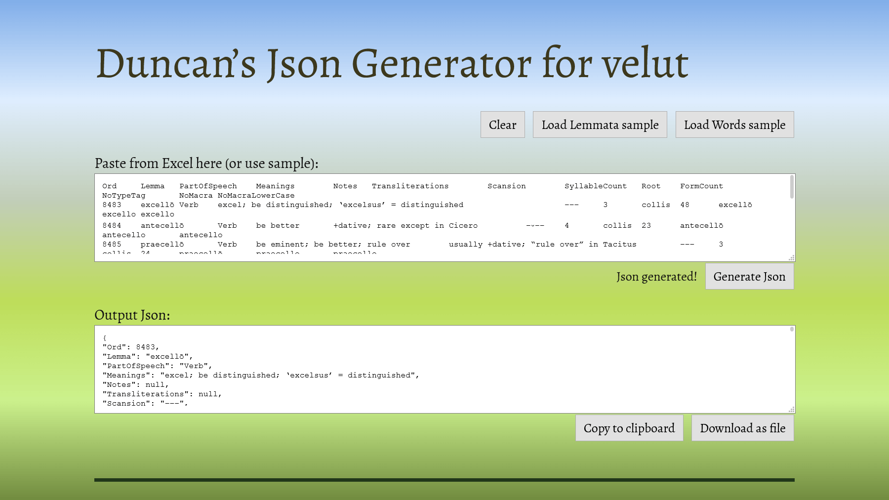

# Duncan’s Json Generator for velut
[See it live.](https://www.duncanritchie.co.uk/velut-json-generator/)

A rudimentary webpage for converting tab-delimited data to mongoimport-flavoured Json. Useful for me, but possibly no-one else.

## How it works for me
I have a website, named [velut](https://github.com/DuncanRitchie/velut), that fetches Latin vocabulary from a MongoDB database. But I generate and store all the data for it in Excel, in a 90MB+ file with many elaborate formulae. I made this Json generator to ease the process of passing my Excel data up to MongoDB.

All the data for velut are in two Excel tables, which correspond to two MongoDB collections and two schemata hardcoded into my Json generator. When I want to update the database, I copy a table from Excel, paste it into the first input box and click “Generate Json”.

Since I’m always copying from either my “words” table or my “lemmata” table (including the header-row), the generator will pick the correct schema and generate the Json accordingly.

I copy (or download) the resulting Json into a file, which is in a private repo, check the diff and ensure the data are all correct, commit it, and then run a mongoimport command to import it into the database. So I can say that this Json generator works for my extremely limited use of it, and that’s good enough for me for the time being.

Since I add vocabulary to my Excel file at least once a month, I can go through this process fairly frequently.

<ins>
	Update: Now that I’ve made the <a href="https://github.com/DuncanRitchie/velut-word-data-generator/">velut Word Data Generator</a>, I no longer use this page for the “words” data.
	I still use it for the “lemmata” data, but at some point I won’t use it for that either.
</ins>

## Limitations
I supply a few rows of sample data for each table so you can see the page working. However, if you’re copying from an Excel table of your own and your data don’t match one of my schemata, you may get strange results. I cannot guarantee that the data-types will be what you want, or that the Json will even be valid. (In fact, if there are any more than one row of data after the header-row, the Json is guaranteed to be invalid in contexts other than mongoimport, because the objects are not comma-delimited and not enclosed in square brackets as an array.)

## Long term
Prior to making this webpage, I wrote (guess what?!) Excel formulae to convert the data to Json, then copied the results from Excel into the Json files. But that was a little tedious, especially since I was generating more rows of Json than can fit in an Excel sheet. I have a long-term ambition to move velut away from Excel and into more efficient/robust/accessible platforms; indeed, the very creation of the velut website was part of that. The creation of this Json generator is another step in this direction; I will be making more webpages like it.

## Screenshot

